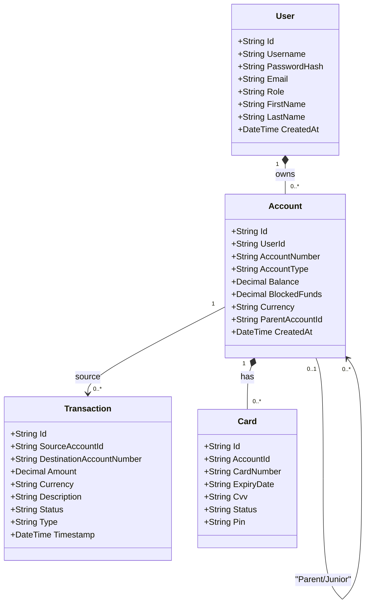
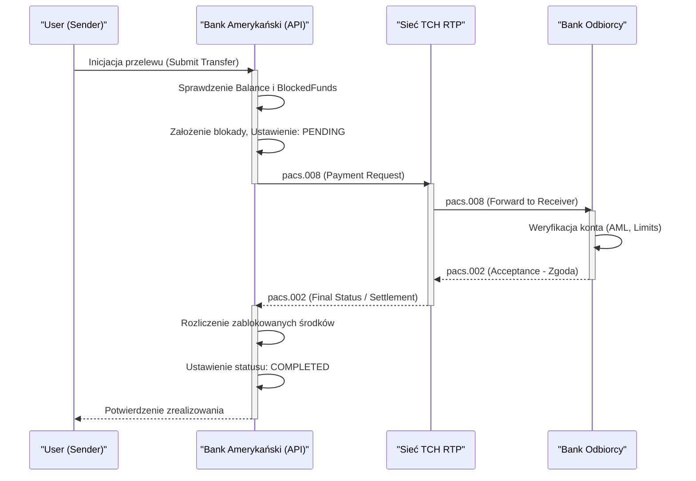

# American Bank (Bank Amerykański)

Aplikacja webowa symulująca działanie nowoczesnego banku amerykańskiego. Głównym zadaniem platformy jest orkiestracja płatności oraz integracja z zewnętrznymi dostawcami infrastruktury clearingowej i autoryzacyjnej w USA (i globalnie).

## 1. Zakres funkcjonalny

- **FedNow** — natychmiastowe płatności krajowe w USA (24/7/365) przetwarzane przez sieć Rezerwy Federalnej. Gwarantuje dostępność środków dla odbiorcy w kilkanaście sekund.
- **RTP (Real-Time Payments)** — komercyjna sieć płatności natychmiastowych dostarczana przez The Clearing House (TCH). Służy głównie do płatności korporacyjnych i P2P.
- **ACH (Automated Clearing House)** — standardowe przelewy krajowe, rozliczenie w sesjach. Podstawa płatności cyklicznych, takich jak wypłaty wynagrodzeń czy polecenia zapłaty.
- **SWIFT** — globalna sieć komunikacji finansowej do przelewów zagranicznych z mechanizmem rachunków korespondenckich.
- **Klik** — system przelewów natychmiastowych P2P wzorowany na rozwiązaniach typu Zelle/Blik, integrujący wiele amerykańskich banków poprzez uwierzytelnienie SMS lub aliasy.
- **Karty płatnicze** — integracja z symulowanym operatorem kart i siecią akceptantów w architekturze "Dual Message System" (osobna autoryzacja i rozliczenie).
- **Konta Junior** — mechanizm nadzoru rodzicielskiego: subkonta powiązane z kontem rodzica, z możliwością autoryzacji transakcji przez opiekuna i odrębnym obiegiem uprawnień.

## 2. Architektura i Stos Technologiczny

| **Warstwa**        | **Technologia**                               |
| ------------------ | --------------------------------------------- |
| **Backend / UI**   | C# 12 + .NET 8 (Blazor Interactive Server)    |
| **Baza danych**    | PostgreSQL 16                                 |
| **ORM**            | Entity Framework Core                         |
| **API Docs**       | Brak (Blazor zarządza ruchem natywnym)        |
| **Auth**           | Custom AuthenticationStateProvider (Cookies)  |
| **Konteneryzacja** | Docker + Docker Compose                       |

## 3. Wiedza Domenowa (Architektura Płatności)

Poniższe reguły biznesowe stanowią fundament logiki naszej aplikacji. Rynek amerykański jest wysoce sfragmentaryzowany i opiera się na równoległym funkcjonowaniu systemów państwowych (Rezerwa Federalna) oraz komercyjnych (The Clearing House).

### 3.1. FedNow (Sieć Rezerwy Federalnej)
Państwowy system rozliczeń brutto w czasie rzeczywistym (RTGS) zaprojektowany dla płatności natychmiastowych 24/7/365.
- **Mechanizm (RTGS z pokryciem natychmiastowym):** Każdy przelew jest rozliczany indywidualnie i natychmiast (brutto) bez kompensaty (nettingu). Wymaga utrzymywania stałego, dodatniego salda w Banku Centralnym przez bank uczestniczący.
- **Standard Komunikatów:** Pełne zastosowanie ISO 20022 (pacs.008 dla żądania, pacs.002 dla statusu).
- **Sytuacje brzegowe:**
  - **Brak Płynności:** Jeśli bank wysyłający nie ma pokrycia na rachunku głównym Fedu, przelew jest natychmiast odrzucany (nie ma tu kolejek "Gridlock" jak w CHAPS czy SORBNET).
  - **Odmowa po stronie odbiorcy:** Przelew wysłany może zostać odrzucony u odbiorcy (np. konto zablokowane ze względów bezpieczeństwa AML).

### 3.2. RTP (Real-Time Payments - The Clearing House)
Kluczowa komercyjna sieć płatności natychmiastowych wprowadzona przed FedNow (w 2017 roku), w całości będąca własnością największych banków amerykańskich.
- **Mechanizm (Rozliczenie Dwuetapowe):** System RTP funkcjonuje jako mechanizm typu _Credit Push_. Bank inicjujący pyta najpierw sieć, sieć odpytuje bank odbiorcy czy ten może przyjąć przelew, a po otrzymaniu potwierdzenia następuje bezwarunkowe rozliczenie w pieniądzu banku centralnego z użyciem specjalnych rachunków TCH.
- **Zasada "Irrevocability" (Nieodwołalność):** Zrealizowany przelew RTP nie może zostać wycofany (brak chargebacków znanych z kart). Jedyna opcja to "Request for Return of Funds", która zależy wyłącznie od dobrej woli odbiorcy.

### 3.3. ACH (Automated Clearing House)
System clearingowy typu _Deferred Net Settlement_ (DNS) wykorzystywany do masowych płatności (payroll, B2B).
- **Mechanizm Batchowy:** Transakcje grupowane są w paczki i przesyłane poprzez pliki płaskie (np. format NACHA poprzez protokoły jak SFTP/Connect:Direct) kilka razy na dobę. 
- **Odroczony Rozrachunek:** Księgowanie jest odroczone, co oznacza wyższe ryzyko kontr-partnera (Credit Risk), a odwołanie transakcji lub odbicie (tzw. ACH Return, jak brak środków "NSF - Non-Sufficient Funds") może nastąpić nawet po 2 dniach roboczych.

### 3.4. SWIFT (Cross-Border Payments)
Architektura płatności transgranicznych (Store-and-Forward). Banki nie przesyłają faktycznej gotówki do siebie nawzajem.
- **Nostro i Vostro:** Bank A (nasz bank) ma rachunek "Nostro" u korespondenta, z którego ściągane są środki. Przelew musi nawigować przez łańcuch banków, gdzie każdy z nich odcina prowizję ("Lifting Fees").
- **Gwarancja Czasowa:** Przelew SWIFT nie daje gwarancji czasowej. Może "wisieć" zablokowany np. na weryfikacji sankcyjnej OFAC po stronie banku pośredniczącego.

### 3.5. Systemy Płatnicze i Karty
W USA dominuje środowisko kart kredytowych, debetowych i sieci bankomatowych (Dual Message System).
- **Krok 1 (Autoryzacja ISO-8583):** Agent rozliczeniowy (np. Stripe/Visa) przesyła tzw. _Authorization Request_. Bank sprawdza limity konta i aplikuje **Hold** (Środki zablokowane) zamiast fizycznie usunąć gotówkę.
- **Krok 2 (Clearing):** Po 1-3 dniach sprzedawca wykonuje tzw. _Capture_ paczką clearingową i dopiero wtedy gotówka jest ostatecznie odejmowana od salda (lub uwalniana, jeśli Capture nie nadejdzie na czas – tzw. _Orphaned Auth_).

## 4. Diagramy Architektoniczne

Poniższe diagramy stworzono przy pomocy Mermaid, dzięki czemu mogą być renderowane i edytowane bezpośrednio w IDE.

### Model domenowy (UML Class Diagram)

Diagram pokazuje architekturę bazy danych. Szczególny nacisk położono na logikę kont (Junior) i blokad środków (Pre-Auth dla Kart).

### Przepływ procesu RTP (BPMN - Sequence Diagram)

W przeciwieństwie do modelu ACH, system RTP działa całkowicie asynchronicznie i wymaga komunikatów dwukierunkowych (ISO 20022). Oczekuje on statusu z banku docelowego zanim dokona obciążenia u nas.

## 5. Konfiguracja Środowiska i Uruchomienie

1. Wymagany Docker oraz Docker Compose.
2. Sklonuj repozytorium.
3. Uzupełnij konfigurację `.env` na wzór swoich środowisk zewnętrznych (w repozytorium udostępniono `.env.example` lub zaszyte dane pod lokalnego docker'a).
4. Uruchom polecenie:
   `docker compose up -d --build`
5. Aplikacja Blazor Server będzie dostępna lokalnie na zmapowanym porcie (domyślnie `http://localhost:8080`).

## 6. Integracje Zewnętrzne

Szczegółowa instrukcja integracji, portów, oraz instrukcja wywoływania testów na tzw. ślepych webhookach (np. poprzez przesyłanie gotowych plików `mock_pacs002.xml`) znajduje się w osobnym pliku `INTEGRATIONS.md`.