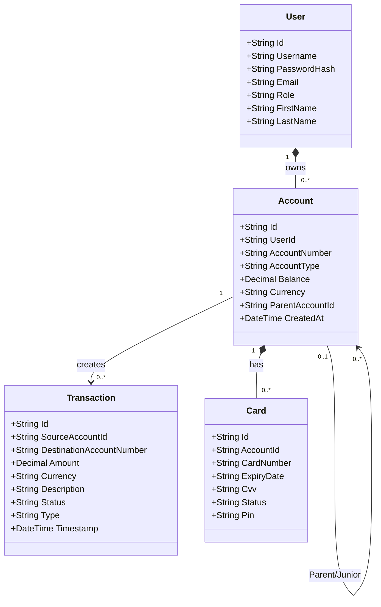
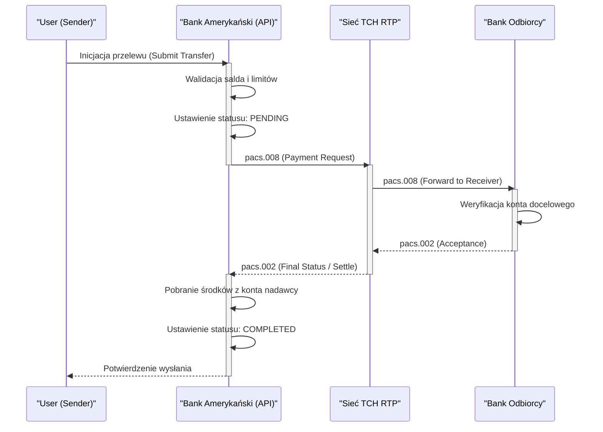

# American Bank (Bank Amerykański)

Aplikacja webowa symulująca działanie nowoczesnego banku amerykańskiego. Głównym zadaniem platformy jest orkiestracja płatności oraz integracja z zewnętrznymi dostawcami infrastruktury clearingowej i autoryzacyjnej w USA (i globalnie).

## 1. Zakres funkcjonalny

- **FedNow** — natychmiastowe płatności krajowe w USA (24/7/365) poprzez sieć Rezerwy Federalnej.
- **RTP (Real-Time Payments)** — sieć płatności natychmiastowych dostarczana przez The Clearing House (TCH).
- **ACH (Automated Clearing House)** — standardowe przelewy krajowe, rozliczenie w sesjach.
- **SWIFT** — globalna sieć komunikacji finansowej do przelewów zagranicznych.
- **Klik** — system przelewów natychmiastowych P2P wzorowany na rozwiązaniach typu Zelle/Blik, integrujący wiele amerykańskich banków.
- **Karty płatnicze** — integracja z symulowanym operatorem kart i siecią akceptantów.
- **Konta Junior** — konta powiązane z kontem rodzica, umożliwiające kontrolę wydatków.

## 2. Architektura i Stos Technologiczny

| **Warstwa**        | **Technologia**                               |
| ------------------ | --------------------------------------------- |
| **Backend / UI**   | C# 12 + .NET 8 (Blazor Interactive Server)    |
| **Baza danych**    | PostgreSQL 16                                 |
| **ORM**            | Entity Framework Core                         |
| **Auth**           | Custom AuthenticationStateProvider (Cookies)  |
| **Konteneryzacja** | Docker + Docker Compose                       |
| **Architektura**   | Monolit z komunikacją asynchroniczną          |

## 3. Wiedza Domenowa (Architektura Płatności)

System opiera się o kilka głównych dróg przetwarzania transakcji. Poprawne mapowanie logiki ma kluczowe znaczenie.

### 3.1. FedNow
System obsługiwany przez Rezerwę Federalną, pozwalający na realizację przelewów w czasie rzeczywistym.
- Wymaga stałej dostępności API po stronie banku (Webhooks/Message Queue).
- Oparty na formacie komunikatów **ISO 20022**.

### 3.2. RTP (The Clearing House)
Prywatna sieć rozliczeń natychmiastowych (RTP).
- Wykorzystuje komunikaty pacs.008 (przelew) oraz pacs.002 (potwierdzenie).
- Działa w trybie dwuetapowym: bank nadawcy wysyła żądanie do TCH, sieć RTP przesyła je do banku docelowego i po zatwierdzeniu generuje finalne potwierdzenie.

### 3.3. ACH (Automated Clearing House)
Rozliczenia w paczkach (batch settlement). Transakcje są zbierane przez cały dzień i przetwarzane wieczorem. Transakcje te są z reguły darmowe lub bardzo tanie, ale mogą zajmować 1-3 dni robocze.

### 3.4. SWIFT (Cross-Border Payments)
Przelewy o zasięgu globalnym, przechodzące przez banki korespondentów (Nostro/Vostro).
- Komunikaty formatu MT lub MX (ISO 20022).
- Wiążą się z dodatkowymi opłatami i przewalutowaniem (Forex).

## 4. Diagramy Architektoniczne

Poniższe diagramy stworzono przy pomocy Mermaid, dzięki czemu mogą być renderowane i edytowane bezpośrednio w IDE.

### Model domenowy (UML Class Diagram)

### Przepływ procesu RTP (BPMN - Sequence Diagram)

## 5. Konfiguracja Środowiska i Uruchomienie

1. Wymagany Docker oraz Docker Compose.
2. Sklonuj repozytorium.
3. Uzupełnij konfigurację `.env` na wzór swoich środowisk zewnętrznych (w repozytorium udostępniono `.env.example` lub zaszyte dane pod lokalnego docker'a).
4. Uruchom polecenie:
   `docker compose up -d --build`
5. Aplikacja Blazor Server będzie dostępna lokalnie na zmapowanym porcie (domyślnie `http://localhost:8080`). Z poziomu tej aplikacji serwowany jest zarówno backend, jak i frontend w nowym trybie .NET 8 Interactive Server.

## 6. Zespół i Repozytoria Integracyjne

- **American Bank (Bank Główny)**: Główne repozytorium z interfejsem dla klientów detalicznych i pracowników.
- **Karty Płatnicze (Payment Gateway)**: Niezależny moduł/kontener obsługujący procesowanie transakcji kartowych.
- **Systemy Fed (FedNow / ACH)**: Środowisko udające procesy amerykańskich systemów płatności wewnątrz sieci Fed.
- **Klik**: Zewnętrzna sieć wzorowana na BLIK / Zelle do płatności mobilnych i natychmiastowych (kody P2P i pay-by-link).
- **RTP**: Oddzielne środowisko emulujące The Clearing House.

Szczegółowa instrukcja i wykaz tego, co jak testować w przypadku powyższych integracji, znajduje się w osobnym pliku `INTEGRATIONS.md`.